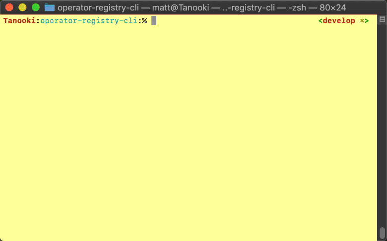

# SolarNetwork DER Challenge: Facility Exchange Registry CLI

This repository contains a proof-of-concept interactive command line application using a 
Protobuf/gRPC based client implementation of the `DerFacilityExchangeRegistryService` defined in 
[der_facility_exchange_registry][der_facility_exchange_registry].



## Building

Gradle is used for building. Run the `build` task via `gradlew`:

	$ ../gradlew build

This will generate a `build/libs/esi-cli-exchange-registry-X.jar` where `X` is a version number.

## Running

Run via `java -jar esi-cli-exchange-registry-X.jar`. The following command line arguments are
supported:

| Argument | Default | Description |
|:---------|:--------|:------------|
| `--help` | | Show command-line argument help. |
| `--no-ssl` | | Do not use SSL. |
| `--uri=uri` | localhost:9090 | The gRPC compliant URI for the ESI Operator Registry to use. |

For example:

```sh
java -jar build/libs/esi-cli-exchange-registry-0.1.0.jar --no-ssl --uri=esi.example.com:9090
```

Once started, an `XReg>` prompt will be shown. The following commands are supported:

| Command | Description |
|:--------|:------------|
| `help`  | Show command help. |
| `list`  | List system operators in the registry. |
| `quit`  | Exit the program. |

For example:

```
XReg> list
Result 1
  Name       Monopoly Utility
  ID         monopoly-utility
  URI        dns:///monopoly.example.com
Result 2
  Name       Earth Utility
  ID         earth-utility
  URI        dns:///earth.localhost
Result 3
  Name       My ESI
  ID         my-esi
  URI        dns:///localhost:9090
```

[der_facility_exchange_registry]: ../api/src/main/proto/solarnetwork/esi/service/der_facility_exchange_registry.proto
