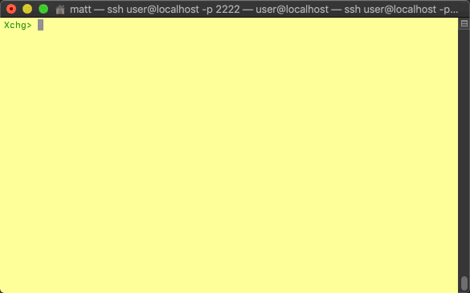

# SolarNetwork DER Challenge: Facility Exchange

This repository contains a proof-of-concept Protobuf/gRPC based server implementation of the
`DerFacilityExchange` defined in [der_facility_exchange][der_facility_exchange].

## Building

Gradle is used for building. Run the `build` task via `gradlew`:

	$ ../gradlew build

This will generate a `build/libs/esi-simple-facility-exchange-X.jar` where `X` is a version number.

# Exchange CLI via SSH

The exchange provides a CLI application you can access via SSH. By default it listens on port **2222**.
To connect, use `ssh` like this:

```shell
ssh user@localhost -p 2222
Password authentication
Password: 
 :: ESI Facility Exchange :: (0.1.0)


Please type `help` to see available commands
Xchg>
```

The password will have been printed on the exchange's console when it started up, like this:

```
--- Generating password for ssh connection: e73d4bfb-d89f-4873-b10c-d87a08998702
```

# Simulation example: show facility price map

A facility [shares a set of "price map" characteristics][fac-price-map-edit] with the exchange.
Following on from the [introduction example][sim-intro], this example shows how to view the price
map information shared by a facility.



## Start up all simulated entities, and SSH into the exchange CLI

If you're not continuing from the [introduction example][sim-intro], then go back and follow that
to get the facility registered with the exchange. Then [SSH into the exchange][ssh].

## Choose the facility of the price map to view

Use the `price-map-show` command to view the price map details of a specific facility. You can pass
a `--facility` argument if you know the UID of the facility already, or don't add any arguments
for the CLI to show a list of all available facilities for you to choose from:

```
Xchg> price-map-show
1) ABC123456789 - test-facility
Enter the number of a facility:
1

Facility test-facility - ABC123456789
Real power                : 1000.000 kW
Reactive power            : 1000.000 kVAR
Duration                  : 100.000 s
Minimum response time     : 120.000 s
Maximum response time     : 300.000 s
Real energy price         : 50.990 USD/kWh
Apparent energy price     : 51.990 USD/kVAh
```


[der_facility_exchange]: ../api/src/main/proto/solarnetwork/esi/service/der_facility_exchange.proto
[fac-price-map-edit]: ../facility-sim-cli/README.md#simulation-example-edit-price-map
[sim-intro]: ../README.md#simulation-example-register-a-facility-with-an-exchange
[ssh]: #exchange-cli-via-ssh
