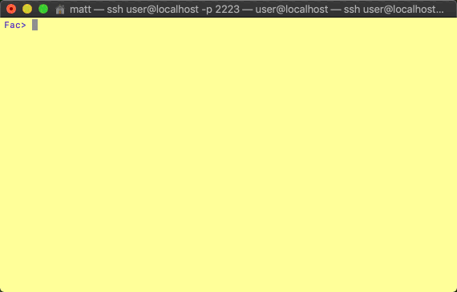

# SolarNetwork DER Challenge: Facility Simulator

This repository contains a proof-of-concept Protobuf/gRPC based server implementation of the
`DerFacility` defined in [der_facility_service][der_facility_service].

## Building

Gradle is used for building. Run the `build` task via `gradlew`:

	$ ../gradlew build

This will generate a `build/libs/esi-simple-facility-simulator-cli-X.jar` where `X` is a version number.


# Simulation example: edit DER characteristics

A facility is expected to maintain a set of characteristics that it shares with the exchange it
integrates with, such as the maximum power it expects to consume or maximum power it might supply.
Following on from the [introduction example][sim-intro], this example shows how to configure the 
characteristics of the simulated facility.


## Start up all simulated entities, and SSH into the facility CLI

If you're not continuing from the [introduction example][sim-intro], then go back and follow that
to get the facility registered with the exchange.

## Edit the characteristics

Use the `resource-edit` command to edit all the available DER characteristic properties. The CLI
will prompt you for values in specific units, showing you the current values inside `[]` brackets,
like this:

```
Fac> resource-edit
Enter Load power max (kW) [0]
1000

Enter Load power factor (-1..1) [0]
0.897

Enter Supply power max (kW) [0]
50000

Enter Supply power factor (-1..1) [0]
0.875

Enter Storage energy capacity (kWh) [0]
100000

Enter Minimum response time (s) [0]
3.5

Enter Maximum response time (s) [0]
6.6
```

Then, the CLI will show you what you've entered and confirm you'd like to save the changes. Type
<kbd>y</kbd> to confirm, and then the characteristics will be posted to the exchange.

```
Here are the values you entered:
Load power max            : 1000.000 kW
Load power factor         : 0.897 
Supply power max          : 50000.000 kW
Supply power factor       : 0.875 
Storage energy capacity   : 100000.000 kWh
Minimum response time     : 3.500 s
Maximum response time     : 6.600 s

Would you like to save these changes?
y
```

The exchange verifies the values and then saves them so it can make use of them going forward. The
exchange replies to the facility that the characteristics have been saved successfully.

```
The resource characteristics have been saved.
```

The facility then saves the values so you can make updates to them in the future if you like.

## Show the characteristics

Use the `resource-show` command to show the current DER characteristics.

```
Fac> resource-show 
Load power max            : 1000.000 kW
Load power factor         : 0.897 
Supply power max          : 50000.000 kW
Supply power factor       : 0.875 
Storage energy capacity   : 100000.000 kWh
Minimum response time     : 3.500 s
Maximum response time     : 6.600 s
```


# Simulation example: choose DER programs

A facility is expected to maintain a set of "active" DER programs it wants to participate in, and
share that information with the exchange it integrates with. Programs represent concepts such as
_peak capacity management_ and _market price response_. Following on from the [introduction
example][sim-intro], this example shows how to configure the active programs of the simulated
facility.



## Start up all simulated entities, and SSH into the facility CLI

If you're not continuing from the [introduction example][sim-intro], then go back and follow that
to get the facility registered with the exchange.

## Choose the programs

Use the `programs-choose` command to view a list of all available programs and select the ones
you want to participate in. The CLI will present a numbered list of programs, and you then enter
a list of the program numbers to activate:

```
Fac> programs-choose
1) Artificial inertia
2) Contractual obligations
3) Frequency regulation
4) Market price response
5) Peak capacity management
6) Ramping
7) Spinning reserve
8) Voltage management
Enter a space or comma-delimited list of program numbers that should be active:
1 5 7 3
```

Then, the CLI will show you what you've entered and confirm you'd like to save the changes. Type
<kbd>y</kbd> to confirm, and then the program list will be posted to the exchange.

```
Here are the programs you specified:
1) Artificial inertia
2) Frequency regulation
3) Peak capacity management
4) Spinning reserve
Would you like to save these changes?
y
```

The exchange verifies the values and then saves them so it can make use of them going forward. The
exchange replies to the facility that the program selections have been saved successfully.

```
The active program types have been saved.
```

The facility then saves the values so you can make updates to them in the future if you like.

[der_facility_service]: ../api/src/main/proto/solarnetwork/esi/service/der_facility_service.proto
[sim-intro]: ../README.md#simulation-example-register-a-facility-with-an-exchange
